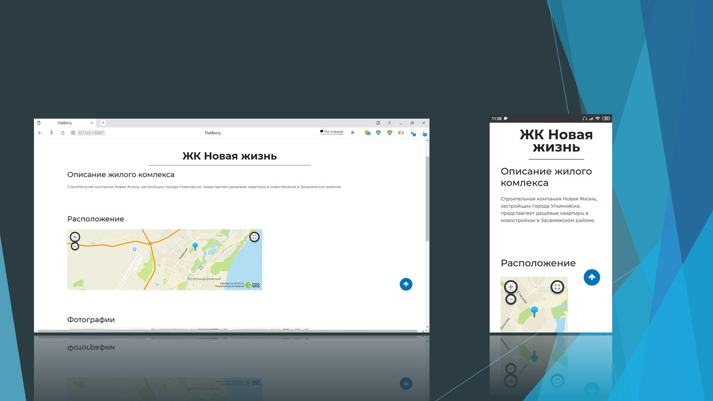

# Веб-сайт на Django
Сайт агентства недвижимости.<br>
Проект создан в целях освоения фреймворка Django, а также для практики верстки.

## Демонстрация




## Установка
Получаем исходный код проекта:
```
$ git clone git@github.com:SladBlack/Django.git
```

Устанавливаем зависимости (перейти в директорию, где лежит requirements.txt):
```
$ pip install -r requirements.txt
```

Команда для запуска проекта на localhost:<br>
```
$ python manage.py runserver
```
После выполнения этой команды откройте `127.0.0.1:8000` в браузере.

### Админка
>Логин: admin<br>
>Пароль: 123
